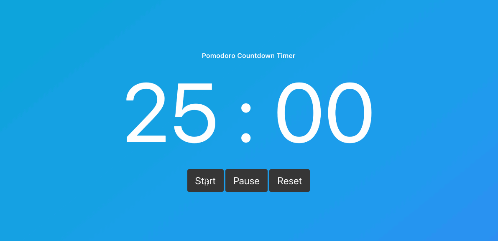

# Pomodoro Technical Challenge

To create a 25 minute Countdown Timer, using vanilla JS / DOM manipulation. This challenge was completed in 1.5 hours.

## Requirements
* The Play button starts the timer.
* The Pause button stops the timer.
* The Reset button returns the timer to its original state of 25 minutes.

